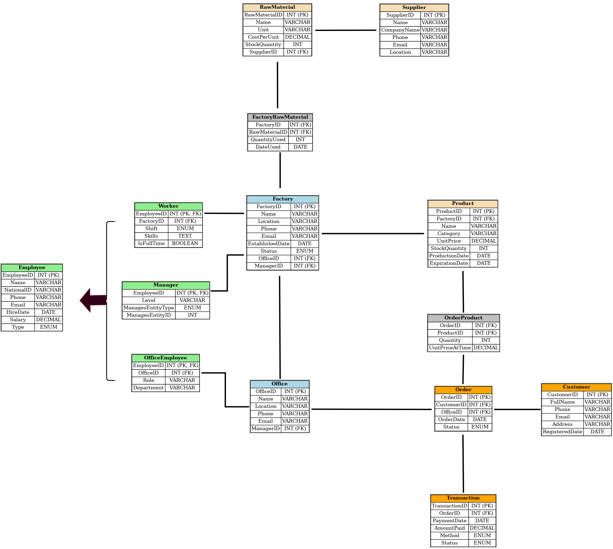

# Full Structured SQL Factory Website

**A full‑stack PHP + MySQL factory management system with a clean, structured SQL schema, CRUD dashboards for HR, orders, factories, and inventory, plus ER diagrams and sample data to get you running fast.**

## Overview
This project is a lightweight web interface for managing a manufacturing business. It covers the full lifecycle from people and facilities to orders and inventory, backed by a normalized SQL schema and sample datasets.

## Core Modules
- **Human Resources**: manage employees, managers, workers, and office staff.
- **Customers & Orders**: register customers, create orders, and track order details.
- **Factory & Raw Materials**: manage factories, products, and raw materials.

## Tech Stack
- PHP (server-side)
- MySQL (database)
- HTML/CSS (UI)

## Project Structure
```
.
├── Factory/               # PHP web app
│   ├── index.php          # Home dashboard
│   ├── config.php         # DB connection settings
│   ├── admin/             # Employee management
│   ├── customers_orders/  # Customers & orders
│   └── factory_raw/       # Factories, products, raw materials
├── schema/                # ER diagrams (draw.io exports)
└── *.sql                  # Schema and sample data dumps
```

## Getting Started (Local)
### Prerequisites
- PHP 8+
- MySQL 8+
- Local server (WAMP/XAMPP/MAMP or PHP built-in server)

### 1) Create and import the database
Use one of the SQL files in the repo:
- **`factory1.sql`**: full schema + sample data (recommended).
- **`factory_db_schema.sql`**: schema only.
- **`factory_sample_data*.sql`**: additional sample datasets.

Example with MySQL:
```
CREATE DATABASE factory1;
USE factory1;
-- then import factory1.sql
```

### 2) Configure DB connection
Update `Factory/config.php` if needed:
```
$host = 'localhost';
$user = 'root';
$password = '';
$database = 'factory1';
```

### 3) Run the app
Option A — WAMP/XAMPP/MAMP:
- Place the repo folder in your web root (e.g., `C:\wamp64\www\full-structured-sql-factory-website`)
- Open: `http://localhost/full-structured-sql-factory-website/Factory/index.php`

Alternatively, you can copy only the `Factory/` folder into your web root and open:
`http://localhost/Factory/index.php`

Option B — PHP built-in server:
```
php -S localhost:8000 -t Factory
```
Then open: `http://localhost:8000/index.php`

## Data Model
The schema models offices, factories, employees (managers, workers, office employees), products, raw materials, suppliers, customers, orders, and transactions.  
See the ER diagrams in `/schema` for a visual overview.


Image source: [`schema/table.drawio.png`](schema/table.drawio.png)

## Notes
- Default connection settings are in `Factory/config.php`.
- The root contains multiple SQL dumps to support different setups.
